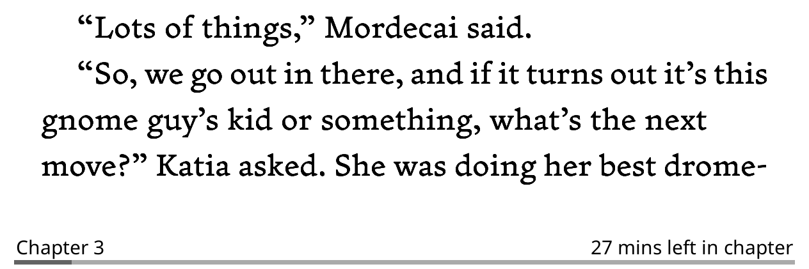
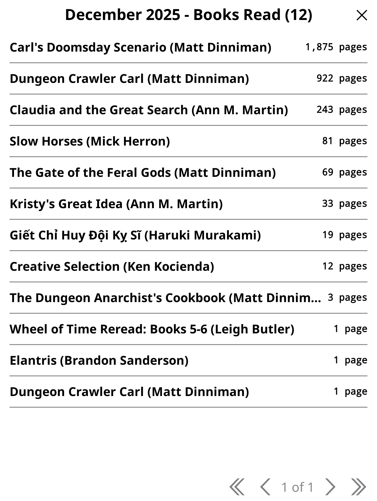
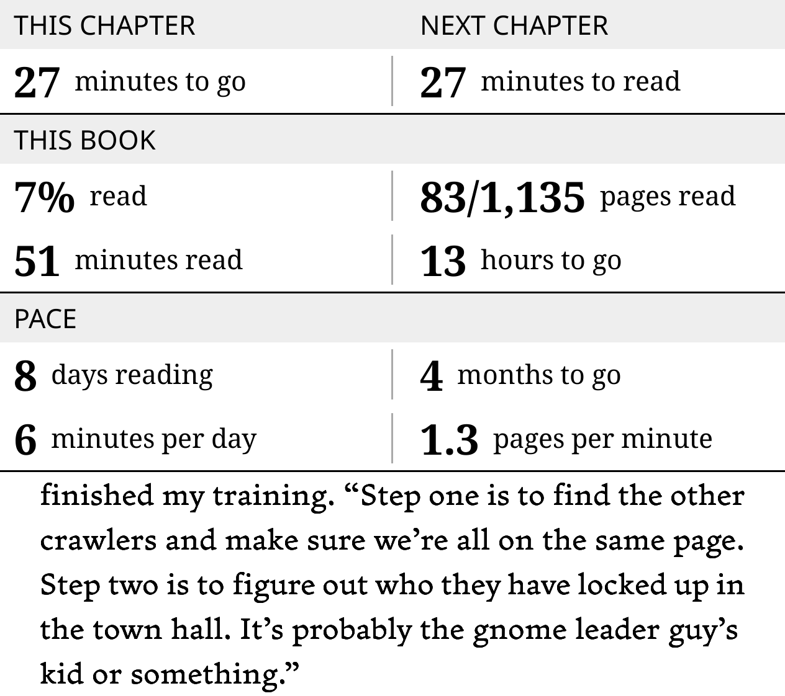

# KOReader User Patches

Some of my personal user patches to add extra bells and whistles to your KOReader experience.

## Installation

1. Make sure you have the `Reading statistics` plugin enabled in `Plugin management`.
2. Create a `patches` directory inside your KOReader folder on the device (if not exists).
3. Copy any `.lua` patch from this repo into `patches/`. They can be used individually or together.
4. Restart KOReader and make sure the patches are enabled in `Patch management`.

## Patches

### `2-chapter-time-format.lua`

More readable time remaining format for the footer. Shows "X hr Y mins left in chapter/book" when hours are present; otherwise falls back to minutes.

Recommended `Status bar items` settings:

- Chapter title
- Dynamic filler
- Time left to finish chapter or Time left to finish book

Screenshot:
 

### `2-reading-insights-popup.lua`

Reading Insights overlay with today stats (time/pages), streaks, yearly totals, a monthly chart, and a books list on tap.
Assign a gesture via `Gesture Manager` to trigger `Reader > Reading statsitics: reading insights`.

Screenshot:
 

 

### `2-reading-stats-popup.lua`

Kobo-style reading stats overlay: chapter time left, next chapter time, book progress, and reading pace.
Assign a gesture via `Gesture Manager` to trigger `Reader > Reading statsitics: overview`.

Screenshot:
 

## License

MIT License. See `LICENSE`.
